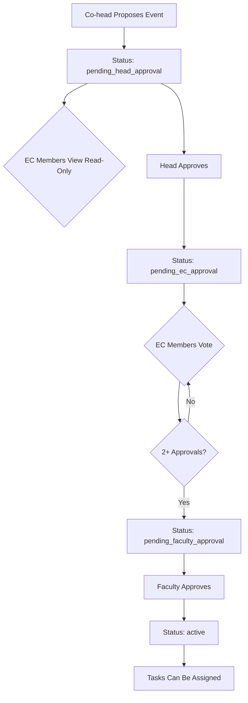
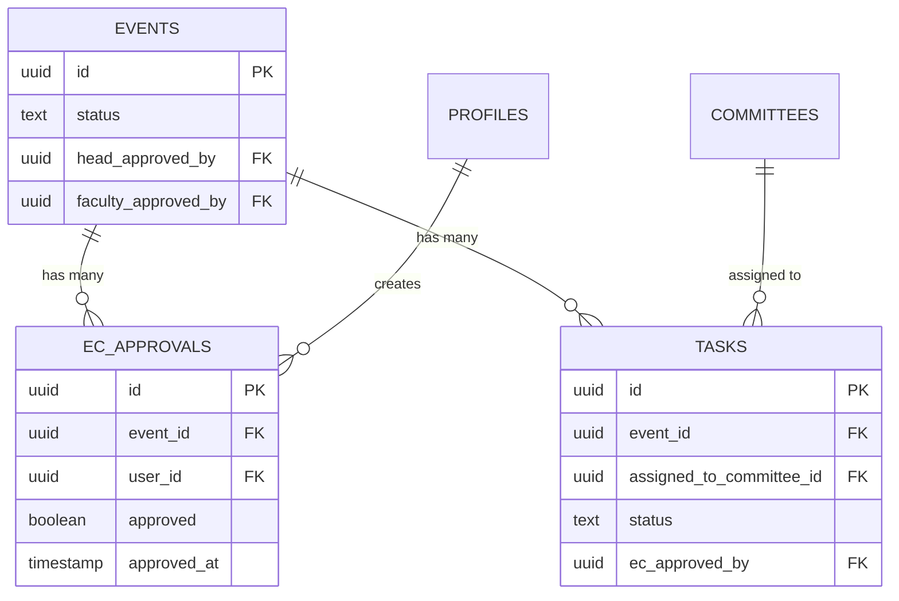

# Approval Workflow Updates - Design Document

## Overview

This design document specifies the implementation changes needed to update the event and task approval workflow in the IIChE AVVU portal. The current system requires all 6 EC members to approve events and tasks, which is too restrictive. The updated workflow will require only 2/6 EC approvals for events and 1/6 EC approval for tasks, while also improving visibility and faculty approval capabilities.

### Key Changes

1. **Event Approval**: Reduce from 6/6 to 2/6 EC member approvals
2. **Task Approval**: Reduce from 6/6 to 1/6 EC member approval
3. **EC Visibility**: Allow EC members to VIEW proposals at `pending_head_approval` stage (read-only)
4. **Faculty Dashboard**: Prominently display pending faculty approvals
5. **Progress Tracking**: Use only EC-approved tasks in progress calculations

### Research Findings

**Approval Workflow Patterns**:
- Multi-stage approval workflows typically use threshold-based approvals (N of M approvers) rather than requiring unanimous consent
- Read-only visibility at earlier stages helps stakeholders prepare for their approval stage
- Progress tracking should exclude items still in approval stages to avoid premature completion signals

**Database Design**:
- The existing `ec_approvals` table supports tracking individual EC member approvals
- Event status transitions: `pending_head_approval` → `pending_ec_approval` → `pending_faculty_approval` → `active`
- Task status transitions: `pending_ec_approval` → `not_started` → `in_progress` → `completed`

## Architecture

### Component Structure

```
app/dashboard/
├── proposals/page.tsx          # Main approval interface (UPDATE)
├── faculty/page.tsx            # Faculty dashboard (UPDATE)
└── events/progress/page.tsx    # Progress tracking (UPDATE)

lib/
└── approval-workflow.ts        # Approval logic utilities (UPDATE)

components/
└── events/
    └── NotionProgressBar.tsx   # Progress visualization (NO CHANGE)
```

### Data Flow



### State Transitions

**Event States**:
- `pending_head_approval`: EC can view (read-only), heads can approve
- `pending_ec_approval`: EC can approve (need 2/6), show approval count
- `pending_faculty_approval`: Faculty can approve from dashboard
- `active`: Event is live, tasks can be assigned

**Task States**:
- `pending_ec_approval`: EC can approve (need 1/6)
- `not_started`: Task approved, waiting to begin
- `in_progress`: Task being worked on
- `completed`: Task finished, counts toward progress

## Components and Interfaces

### 1. Proposals Page (`app/dashboard/proposals/page.tsx`)

**Current Issues**:
- EC members cannot see proposals at `pending_head_approval`
- Approval logic checks for all 6 EC approvals
- No clear indication of approval progress

**Required Changes**:

```typescript
// Update query logic to show pending_head_approval to EC members
if (isEC && !isFaculty && !isAdmin) {
  query = query.in('status', [
    'pending_head_approval',      // NEW: EC can view read-only
    'pending_ec_approval',
    'pending_faculty_approval',
    'active',
    'cancelled'
  ]);
}

// Update approval threshold check
if (allApprovals && allApprovals.length >= 2) {  // Changed from >= 6
  // Move to faculty approval
}
```

**UI Components**:
- Approval progress bar showing "X/2 EC approvals" (changed from X/6)
- Disabled approve button at `pending_head_approval` with tooltip
- List of EC members who have approved
- Clear status badges for each stage

### 2. Faculty Dashboard (`app/dashboard/faculty/page.tsx`)

**Current Issues**:
- Pending faculty approvals not prominently displayed
- No quick action for event approval

**Required Changes**:

```typescript
// Add prominent pending approvals section at top
<div className="bg-white rounded-xl shadow-lg p-6 mb-8">
  <h2>Pending Event Approvals</h2>
  {pendingApprovals.map(event => (
    <EventApprovalCard
      event={event}
      onApprove={approveEvent}
      onReject={rejectEvent}
    />
  ))}
</div>
```

**UI Components**:
- Dedicated "Pending Approvals" section at dashboard top
- Quick approve/reject buttons with inline reason input
- Event details preview (title, committee, date, budget)
- Approval history showing head and EC approvals

### 3. Event Progress Page (`app/dashboard/events/progress/page.tsx`)

**Current Issues**:
- Progress calculation includes tasks at `pending_ec_approval`
- No filtering of rejected tasks

**Required Changes**:

```typescript
// Filter tasks for progress calculation
const getCommitteeTaskSummary = () => {
  tasks.forEach(task => {
    // Exclude pending and rejected tasks
    if (task.status === 'pending_ec_approval' || 
        task.status === 'ec_rejected') {
      return;  // Skip this task
    }
    // Count only approved tasks
  });
};
```

**UI Components**:
- Progress bar uses only EC-approved tasks
- Task cards show approval status
- Filter to show/hide pending tasks
- Visual distinction for task states

### 4. Approval Workflow Utilities (`lib/approval-workflow.ts`)

**Current Issues**:
- No specific function for EC approval with threshold
- Task approval assumes all EC members must approve

**Required Changes**:

```typescript
// Update EC approval function
export async function approveEventAsEC(
  eventId: string,
  userId: string,
  userRole: UserRole
) {
  // Record individual approval
  await supabase.from('ec_approvals').upsert({
    event_id: eventId,
    user_id: userId,
    approved: true,
    approved_at: new Date().toISOString()
  });

  // Check threshold (2 approvals)
  const { data: approvals } = await supabase
    .from('ec_approvals')
    .select('*')
    .eq('event_id', eventId)
    .eq('approved', true);

  if (approvals && approvals.length >= 2) {
    // Move to faculty approval
    await supabase.from('events').update({
      status: 'pending_faculty_approval'
    }).eq('id', eventId);
  }
}

// Add task approval function with 1/6 threshold
export async function approveTaskAsEC(
  taskId: string,
  userId: string,
  userRole: UserRole
) {
  // Single approval is sufficient
  await supabase.from('tasks').update({
    status: 'not_started',
    ec_approved_by: userId,
    ec_approved_at: new Date().toISOString()
  }).eq('id', taskId);
}
```

## Data Models

### Existing Tables (No Schema Changes Required)

**events table**:
```sql
- id: uuid
- title: text
- status: event_status
- head_approved_by: uuid
- head_approved_at: timestamp
- faculty_approved_by: uuid
- faculty_approved_at: timestamp
```

**ec_approvals table**:
```sql
- id: uuid
- event_id: uuid (FK to events)
- user_id: uuid (FK to profiles)
- approved: boolean
- approved_at: timestamp
```

**tasks table**:
```sql
- id: uuid
- event_id: uuid (FK to events)
- assigned_to_committee_id: uuid (FK to committees)
- status: task_status
- ec_approved_by: uuid
- ec_approved_at: timestamp
```

### Data Relationships



## Correctness Properties

*A property is a characteristic or behavior that should hold true across all valid executions of a system—essentially, a formal statement about what the system should do. Properties serve as the bridge between human-readable specifications and machine-verifiable correctness guarantees.*


### Property Reflection

After analyzing all acceptance criteria, I identified the following redundancies:

**Redundant Properties**:
- CP-1, CP-2, and CP-3 from the requirements document duplicate user story acceptance criteria
- US-2.2 (shows approval count) and US-2.4 (shows which members approved) can be combined into a single property about approval display accuracy
- US-1.1 (EC can see) and US-1.2 (approval disabled) can be combined into a single property about read-only visibility
- US-5.2 (add updates) and US-5.3 (attach documents) can be combined into a single property about task update creation

**Consolidated Properties**:
After removing duplicates and combining related properties, we have 12 unique properties to test:

1. EC read-only visibility at pending_head_approval (combines US-1.1, US-1.2, US-1.4)
2. EC approval display accuracy (combines US-2.2, US-2.4)
3. Event approval threshold (US-2.3 / CP-1)
4. EC approval action availability (US-2.1)
5. Faculty visibility rules (US-3.1)
6. Faculty approval actions (US-3.2)
7. Faculty approval transition (US-3.3)
8. Active event visibility (US-3.4)
9. Task approval threshold (US-4.3 / CP-2)
10. Task visibility after approval (US-4.4)
11. Task status transitions (US-5.1)
12. Task update creation (combines US-5.2, US-5.3)
13. Progress calculation accuracy (US-5.4)
14. Student visibility rules (CP-3.4)

### Property 1: EC Read-Only Visibility at Pending Head Approval

*For any* event with status `pending_head_approval` and any EC member user, the EC member should be able to view all event details, but approval actions should not be available.

**Validates: Requirements US-1.1, US-1.2, US-1.4**

### Property 2: EC Approval Display Accuracy

*For any* event at status `pending_ec_approval`, the displayed approval count and list of approvers should exactly match the approved records in the `ec_approvals` table.

**Validates: Requirements US-2.2, US-2.4**

### Property 3: Event Approval Threshold

*For any* event at status `pending_ec_approval`, when the number of EC member approvals reaches exactly 2, the event status should transition to `pending_faculty_approval`.

**Validates: Requirements US-2.3, CP-1**

### Property 4: EC Approval Action Availability

*For any* event at status `pending_ec_approval` and any EC member who has not yet approved, the approval action should be available to that EC member.

**Validates: Requirements US-2.1**

### Property 5: Faculty Visibility Rules

*For any* faculty user, queries for pending approvals should return all and only events with status `pending_faculty_approval`.

**Validates: Requirements US-3.1**

### Property 6: Faculty Approval Actions

*For any* event at status `pending_faculty_approval`, faculty users should have both approve and reject actions available, and rejection should require a non-empty reason.

**Validates: Requirements US-3.2**

### Property 7: Faculty Approval Transition

*For any* event at status `pending_faculty_approval`, when a faculty user approves it, the event status should transition to `active` and the `faculty_approved_by` field should be set to that faculty user's ID.

**Validates: Requirements US-3.3**

### Property 8: Active Event Visibility

*For any* event with status `active`, users of all roles (student, committee member, EC, faculty, admin) should be able to view the event.

**Validates: Requirements US-3.4**

### Property 9: Task Approval Threshold

*For any* task at status `pending_ec_approval`, when exactly 1 EC member approves it, the task status should transition to `not_started`.

**Validates: Requirements US-4.3, CP-2**

### Property 10: Task Visibility After Approval

*For any* task with status `not_started`, `in_progress`, or `completed`, the task should appear in queries filtered by its `assigned_to_committee_id`.

**Validates: Requirements US-4.4**

### Property 11: Task Status Transitions

*For any* task, the status transitions `not_started` → `in_progress` → `completed` should be valid and allowed.

**Validates: Requirements US-5.1**

### Property 12: Task Update Creation

*For any* task and any committee member of the assigned committee, creating a task update with text and optional document attachments should succeed and associate the update with the task.

**Validates: Requirements US-5.2, US-5.3**

### Property 13: Progress Calculation Accuracy

*For any* event with associated tasks, the progress calculation should include only tasks with status `not_started`, `in_progress`, or `completed`, excluding tasks with status `pending_ec_approval` or `ec_rejected`.

**Validates: Requirements US-5.4**

### Property 14: Student Visibility Rules

*For any* student user (non-EC, non-faculty, non-admin), queries for events should return only events with status `active`.

**Validates: Requirements CP-3.4**

## Error Handling

### Validation Errors

**Event Approval**:
- Attempting to approve at wrong status → Return error "Event is not at the correct approval stage"
- Non-EC user attempting EC approval → Return error "User does not have EC approval permissions"
- EC member approving twice → Update existing approval record (idempotent)
- Approving non-existent event → Return error "Event not found"

**Task Approval**:
- Attempting to approve at wrong status → Return error "Task is not pending EC approval"
- Non-EC user attempting approval → Return error "User does not have EC approval permissions"
- Approving non-existent task → Return error "Task not found"

**Faculty Approval**:
- Non-faculty user attempting faculty approval → Return error "User does not have faculty permissions"
- Rejecting without reason → Return error "Rejection reason is required"
- Approving already active event → Return error "Event is already active"

### Database Errors

**Concurrency Handling**:
- Multiple EC members approving simultaneously → Use database transactions to ensure accurate count
- Race condition on threshold check → Use SELECT FOR UPDATE or optimistic locking
- Duplicate approval records → Use UPSERT with unique constraint on (event_id, user_id)

**Data Integrity**:
- Orphaned ec_approvals records → Cascade delete when event is deleted
- Invalid status transitions → Validate status before update
- Missing required fields → Validate before insert/update

### User Feedback

**Success Messages**:
- EC approval recorded: "Your approval recorded (X/2 EC approvals)"
- Threshold reached: "Executive Committee approval complete! Sent to Faculty Advisor"
- Faculty approval: "Event approved and activated!"
- Task approval: "Task approved and assigned to committee"

**Error Messages**:
- Permission denied: "You don't have permission to perform this action"
- Invalid state: "This item cannot be approved at its current stage"
- Missing data: "Please provide all required information"

## Testing Strategy

### Dual Testing Approach

This feature will use both unit tests and property-based tests for comprehensive coverage:

**Unit Tests**: Focus on specific examples, edge cases, and integration points
- Test specific approval scenarios (e.g., exactly 2 EC approvals)
- Test permission checks for each role
- Test UI component rendering for different states
- Test error handling for invalid inputs

**Property Tests**: Verify universal properties across all inputs
- Generate random events and users to test visibility rules
- Generate random approval sequences to test threshold logic
- Generate random task states to test progress calculations
- Minimum 100 iterations per property test

### Property-Based Testing Configuration

**Testing Library**: Use `fast-check` for TypeScript/JavaScript property-based testing

**Test Configuration**:
```typescript
import fc from 'fast-check';

// Each property test runs 100+ iterations
fc.assert(
  fc.property(
    // Generators for random test data
    eventGenerator,
    ecMemberGenerator,
    (event, ecMember) => {
      // Property assertion
    }
  ),
  { numRuns: 100 }
);
```

**Test Tags**: Each property test must include a comment tag:
```typescript
// Feature: approval-workflow-updates, Property 3: Event Approval Threshold
test('event transitions to pending_faculty_approval at 2 EC approvals', () => {
  // Property test implementation
});
```

### Unit Test Coverage

**Proposals Page Tests**:
- EC member can view pending_head_approval events (read-only)
- Approval button disabled at pending_head_approval
- Approval count displays correctly (X/2)
- List of approvers displays correctly
- Status transitions after threshold reached

**Faculty Dashboard Tests**:
- Pending approvals section displays events
- Approve button triggers correct API call
- Reject button requires reason input
- Success/error messages display correctly

**Progress Page Tests**:
- Progress calculation excludes pending tasks
- Progress calculation excludes rejected tasks
- Task status updates trigger progress recalculation
- Committee task summary groups correctly

**Approval Workflow Tests**:
- `approveEventAsEC` records individual approval
- `approveEventAsEC` checks threshold and transitions status
- `approveTaskAsEC` transitions task to not_started
- `approveEventAsFaculty` transitions event to active
- All functions log approval actions correctly

### Integration Tests

**End-to-End Approval Flow**:
1. Co-head proposes event → Status is pending_head_approval
2. EC member views event → Can see details, cannot approve
3. Head approves → Status becomes pending_ec_approval
4. First EC member approves → Status stays pending_ec_approval
5. Second EC member approves → Status becomes pending_faculty_approval
6. Faculty approves → Status becomes active
7. Verify event visible to all users

**Task Approval Flow**:
1. Create task for active event → Status is pending_ec_approval
2. EC member approves → Status becomes not_started
3. Committee member updates status → Status becomes in_progress
4. Committee member marks complete → Status becomes completed
5. Verify progress bar updates

### Test Data Generators

**Event Generator**:
```typescript
const eventGenerator = fc.record({
  id: fc.uuid(),
  title: fc.string({ minLength: 1, maxLength: 100 }),
  status: fc.constantFrom(
    'pending_head_approval',
    'pending_ec_approval',
    'pending_faculty_approval',
    'active'
  ),
  committee_id: fc.uuid(),
  proposed_by: fc.uuid()
});
```

**EC Member Generator**:
```typescript
const ecMemberGenerator = fc.record({
  id: fc.uuid(),
  name: fc.string({ minLength: 1 }),
  executive_role: fc.constantFrom(
    'secretary',
    'joint_secretary',
    'treasurer',
    'associate_secretary',
    'associate_joint_secretary',
    'associate_treasurer'
  )
});
```

**Task Generator**:
```typescript
const taskGenerator = fc.record({
  id: fc.uuid(),
  event_id: fc.uuid(),
  assigned_to_committee_id: fc.uuid(),
  status: fc.constantFrom(
    'pending_ec_approval',
    'not_started',
    'in_progress',
    'completed',
    'ec_rejected'
  )
});
```

## Implementation Plan

### Phase 1: Update Approval Logic (Priority: High)

**Files to Modify**:
- `lib/approval-workflow.ts`

**Changes**:
1. Update `approveEventAsEC` to check for 2 approvals instead of 6
2. Add `approveTaskAsEC` function with 1-approval threshold
3. Ensure all approval functions log to `approval_logs` table
4. Add validation for approval permissions

**Estimated Effort**: 2-3 hours

### Phase 2: Update Proposals Page (Priority: High)

**Files to Modify**:
- `app/dashboard/proposals/page.tsx`

**Changes**:
1. Update query to include `pending_head_approval` for EC members
2. Add conditional rendering for read-only view
3. Update approval count display (X/2 instead of X/6)
4. Update threshold check in `handleECApprove`
5. Add tooltip for disabled approve button
6. Improve approval progress visualization

**Estimated Effort**: 3-4 hours

### Phase 3: Update Faculty Dashboard (Priority: Medium)

**Files to Modify**:
- `app/dashboard/faculty/page.tsx`

**Changes**:
1. Move pending approvals section to top of dashboard
2. Enhance event approval cards with more details
3. Add inline approve/reject actions
4. Improve visual hierarchy for pending items
5. Add approval history display

**Estimated Effort**: 2-3 hours

### Phase 4: Update Progress Tracking (Priority: Medium)

**Files to Modify**:
- `app/dashboard/events/progress/page.tsx`

**Changes**:
1. Update `getCommitteeTaskSummary` to filter out pending/rejected tasks
2. Add visual indicators for task approval status
3. Add filter toggle to show/hide pending tasks
4. Update task cards to show EC approval status

**Estimated Effort**: 2-3 hours

### Phase 5: Testing (Priority: High)

**Test Files to Create**:
- `__tests__/approval-workflow.test.ts`
- `__tests__/proposals-page.test.tsx`
- `__tests__/faculty-dashboard.test.tsx`
- `__tests__/progress-tracking.test.tsx`
- `__tests__/properties/approval-properties.test.ts`

**Changes**:
1. Write unit tests for all modified functions
2. Write property-based tests for all 14 properties
3. Write integration tests for approval flows
4. Set up test data generators
5. Configure fast-check with 100+ iterations

**Estimated Effort**: 6-8 hours

### Phase 6: Documentation and Deployment (Priority: Low)

**Files to Create/Update**:
- Update user documentation
- Add inline code comments
- Update API documentation

**Estimated Effort**: 1-2 hours

**Total Estimated Effort**: 16-23 hours

## Security Considerations

### Permission Checks

**Event Approval**:
- Verify user has EC role before allowing EC approval
- Verify user is committee head before allowing head approval
- Verify user is faculty before allowing faculty approval
- Check event status before allowing approval action

**Task Approval**:
- Verify user has EC role before allowing task approval
- Verify task belongs to active event
- Check task status before allowing approval

**Visibility**:
- Filter events based on user role and event status
- Filter tasks based on user role and committee membership
- Never expose pending items to students

### Audit Logging

All approval actions must be logged to `approval_logs` table:
- User ID and role
- Action performed (approve/reject)
- Entity type and ID
- Previous and new status
- Timestamp
- Reason (for rejections)

### Data Validation

**Input Validation**:
- Validate event/task IDs are valid UUIDs
- Validate status values are from allowed enum
- Validate rejection reasons are non-empty
- Sanitize all user inputs

**State Validation**:
- Verify event/task exists before approval
- Verify status allows the requested action
- Verify user hasn't already approved (for idempotency)

## Performance Considerations

### Database Queries

**Optimization Strategies**:
- Use indexes on status columns for filtering
- Use indexes on foreign keys (event_id, user_id)
- Batch load ec_approvals for multiple events
- Use select specific columns instead of SELECT *

**Query Examples**:
```sql
-- Efficient approval count query
SELECT event_id, COUNT(*) as approval_count
FROM ec_approvals
WHERE approved = true
GROUP BY event_id;

-- Efficient visibility query with index
SELECT * FROM events
WHERE status = 'pending_faculty_approval'
AND deleted_at IS NULL;
```

### Caching Strategy

**Client-Side Caching**:
- Cache approval counts for 30 seconds
- Invalidate cache on approval action
- Use optimistic updates for better UX

**Server-Side Caching**:
- Cache committee membership for session duration
- Cache user permissions for request duration

### Real-Time Updates

**Consideration**: Multiple EC members may approve simultaneously

**Solution**: Use Supabase real-time subscriptions for approval updates
```typescript
supabase
  .channel('ec_approvals')
  .on('postgres_changes', {
    event: 'INSERT',
    schema: 'public',
    table: 'ec_approvals'
  }, (payload) => {
    // Refresh approval count
    loadProposals();
  })
  .subscribe();
```

## Accessibility Considerations

### Keyboard Navigation

- All approval buttons must be keyboard accessible
- Tab order should be logical (event details → approve → reject)
- Focus indicators must be visible
- Escape key should close modals

### Screen Reader Support

- Use semantic HTML (button, not div with onClick)
- Add aria-labels for icon-only buttons
- Announce status changes with aria-live regions
- Provide text alternatives for visual indicators

### Visual Design

- Approval progress bars must have text labels
- Status badges must not rely on color alone
- Sufficient color contrast (WCAG AA minimum)
- Disabled buttons must be visually distinct

## Monitoring and Observability

### Metrics to Track

**Approval Metrics**:
- Average time from proposal to head approval
- Average time from head approval to EC approval (2 members)
- Average time from EC approval to faculty approval
- Approval rejection rate by stage

**System Metrics**:
- API response time for approval actions
- Database query performance for visibility filters
- Error rate for approval operations
- Concurrent approval conflicts

### Logging

**Application Logs**:
- Log all approval actions with context
- Log permission check failures
- Log validation errors
- Log database errors

**Audit Logs**:
- All approval/rejection actions in `approval_logs` table
- Include user ID, timestamp, and reason
- Immutable records (no updates/deletes)

## Rollback Plan

### Deployment Strategy

1. Deploy database changes (if any) - NONE REQUIRED
2. Deploy backend changes (approval-workflow.ts)
3. Deploy frontend changes (pages)
4. Monitor error rates and user feedback
5. Rollback if critical issues found

### Rollback Procedure

If critical issues are discovered:

1. Revert frontend changes (restore previous page versions)
2. Revert backend changes (restore previous approval logic)
3. Verify system returns to previous behavior
4. Investigate and fix issues
5. Redeploy with fixes

### Feature Flags

Consider using feature flags for gradual rollout:
```typescript
const USE_NEW_APPROVAL_WORKFLOW = process.env.NEXT_PUBLIC_NEW_APPROVAL_WORKFLOW === 'true';

if (USE_NEW_APPROVAL_WORKFLOW) {
  // New 2/6 logic
} else {
  // Old 6/6 logic
}
```

## Future Enhancements

### Out of Scope for This Release

1. **Email Notifications**: Notify EC members when event needs approval
2. **Approval Deadlines**: Set time limits for approval stages
3. **Bulk Task Approval**: Approve multiple tasks at once
4. **Approval Analytics**: Dashboard showing approval metrics
5. **Custom Approval Workflows**: Configure thresholds per committee
6. **Approval Comments**: Allow approvers to add comments
7. **Approval History Export**: Download approval logs as CSV

### Potential Future Work

1. **Mobile App**: Native mobile app for quick approvals
2. **Push Notifications**: Real-time notifications for pending approvals
3. **Approval Reminders**: Automated reminders for pending items
4. **Delegation**: Allow EC members to delegate approval authority
5. **Conditional Approvals**: Approve with conditions/modifications

## Conclusion

This design document specifies the changes needed to update the approval workflow from requiring all 6 EC members to approve (6/6) to requiring only 2 EC members for events (2/6) and 1 EC member for tasks (1/6). The design maintains data integrity, improves visibility for stakeholders, and enhances the faculty approval experience.

Key implementation points:
- No database schema changes required
- Update approval threshold checks in code
- Improve UI to show approval progress
- Filter progress calculations to exclude pending tasks
- Comprehensive testing with property-based tests

The implementation is estimated at 16-23 hours and can be completed in 6 phases with clear rollback procedures if issues arise.
