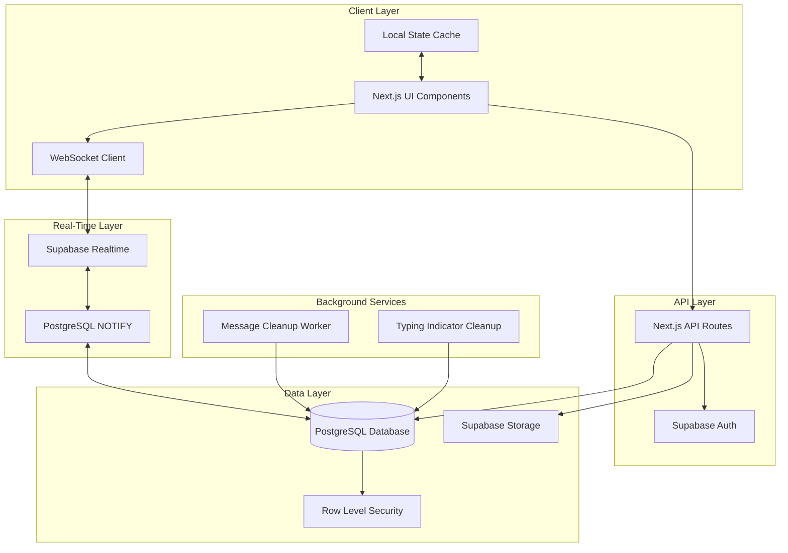
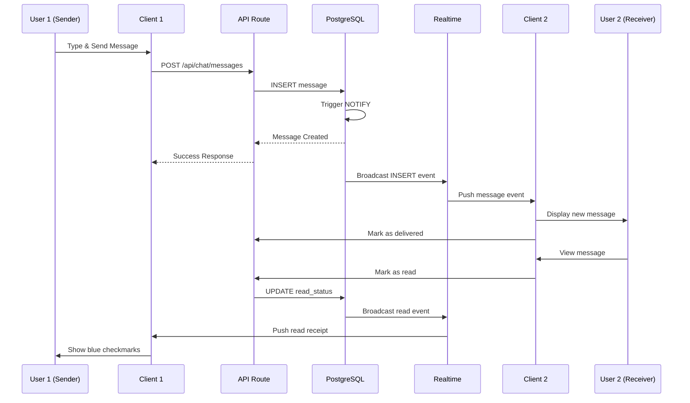
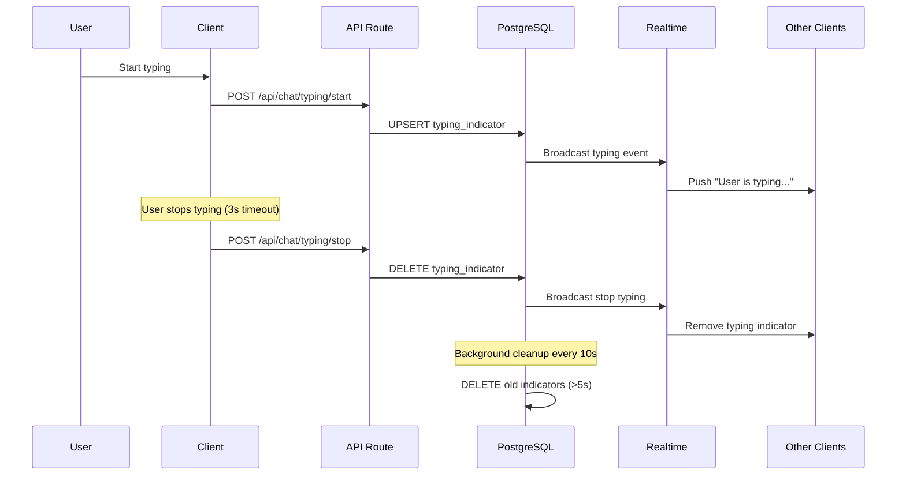
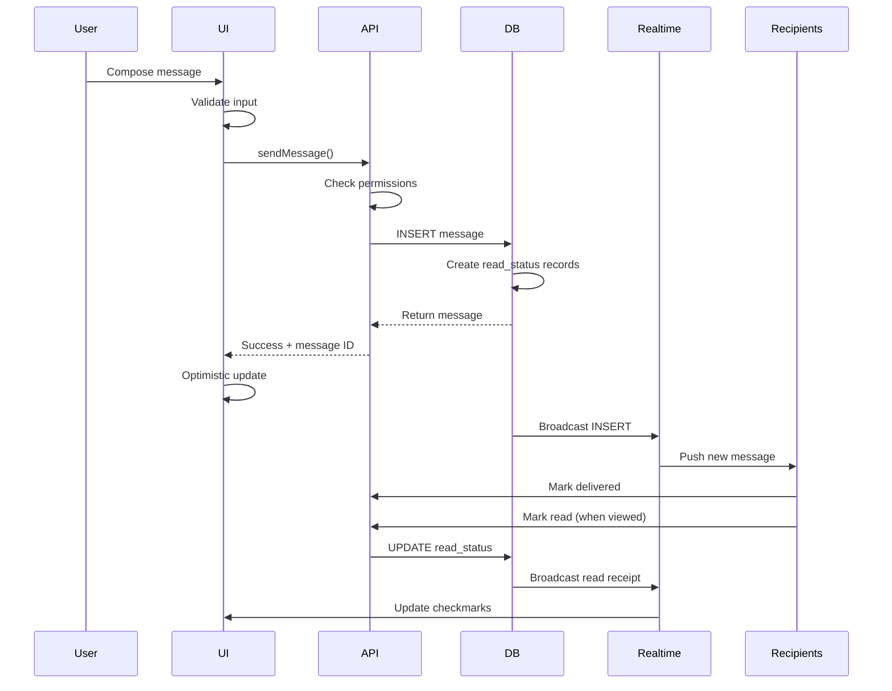

# Design Document: WhatsApp-like Interactive Chat System

## Overview

This design document outlines a comprehensive WhatsApp-style chat system for the IIChE Student Chapter portal. The system provides real-time messaging with role-based group chats, 1-to-1 conversations, rich media support, message reactions, read receipts, typing indicators, and advanced features like message editing, deletion, forwarding, and pinning. Built on Supabase Realtime with Next.js and TypeScript, the system ensures instant synchronization across all clients while maintaining strict role-based access control aligned with the organization's committee structure.

The architecture leverages Supabase's real-time subscriptions for instant message delivery, PostgreSQL for reliable data storage with RLS policies for security, and Supabase Storage for media files. The design emphasizes performance through optimized queries, pagination, and efficient real-time event handling, while providing a mobile-responsive UI that mirrors WhatsApp's familiar interaction patterns.

## Architecture

### System Architecture Diagram



### Real-Time Message Flow



### Typing Indicator Flow



## Components and Interfaces

### Core Data Models


#### Enhanced ChatMessage Model

```typescript
interface ChatMessage {
  id: string;
  group_id: string;
  sender_id: string | null;
  message: string | null;
  file_url: string | null;
  file_type: string | null;
  file_name: string | null;
  file_size: number | null;
  reply_to: string | null;
  is_deleted: boolean;
  is_edited: boolean;
  edited_at: string | null;
  is_pinned: boolean;
  pinned_by: string | null;
  pinned_at: string | null;
  created_at: string;
  updated_at: string;
}
```

**Validation Rules**:
- At least one of `message` or `file_url` must be non-null
- `file_type` required when `file_url` is present
- `is_edited` can only be true if message was created more than 1 second ago
- `edited_at` must be within 5 minutes of `created_at` for user edits
- `is_pinned` requires `pinned_by` and `pinned_at` to be non-null


#### Message Reactions Model

```typescript
interface MessageReaction {
  id: string;
  message_id: string;
  user_id: string;
  emoji: string;
  created_at: string;
}
```

**Validation Rules**:
- `emoji` must be a valid Unicode emoji character
- One user can only have one reaction per message (upsert behavior)
- Reactions persist even if message is edited

#### Message Read Status Model

```typescript
interface MessageReadStatus {
  id: string;
  message_id: string;
  user_id: string;
  delivered_at: string | null;
  read_at: string | null;
  created_at: string;
}
```

**Validation Rules**:
- `read_at` must be >= `delivered_at` when both are set
- Cannot mark own messages as read
- Automatically created when message is sent (delivered_at = created_at)


#### Enhanced ChatGroup Model

```typescript
interface ChatGroup {
  id: string;
  name: string;
  chat_type: ChatType;
  committee_id: string | null;
  created_by: string | null;
  avatar_url: string | null;
  description: string | null;
  is_muted: boolean;
  muted_until: string | null;
  created_at: string;
  updated_at: string;
}

type ChatType = 
  | 'personal'           // 1-to-1 chat
  | 'committee'          // Committee-specific group
  | 'organization'       // All members
  | 'executive'          // EC Board only
  | 'heads'              // All committee heads
  | 'coheads'            // All committee co-heads
  | 'custom_group';      // User-created groups
```

**Validation Rules**:
- `committee_id` required when `chat_type` is 'committee'
- `chat_type` 'personal' must have exactly 2 participants
- System groups (organization, executive, heads, coheads) cannot be deleted
- `muted_until` must be in the future when `is_muted` is true


#### Typing Indicator Model

```typescript
interface TypingIndicator {
  id: string;
  group_id: string;
  user_id: string;
  started_at: string;
}
```

**Validation Rules**:
- Automatically deleted after 5 seconds of inactivity
- One user can only have one active typing indicator per group
- Background cleanup job removes stale indicators

#### Message Forward Model

```typescript
interface MessageForward {
  id: string;
  original_message_id: string;
  forwarded_to_group_id: string;
  forwarded_by: string;
  created_at: string;
}
```

**Validation Rules**:
- User must be participant in both source and destination groups
- Cannot forward deleted messages
- Forwarded message creates new message in destination group


### Component Architecture

#### 1. ChatListPanel Component

**Purpose**: Display all chat groups and conversations with preview, unread counts, and last message

**Interface**:
```typescript
interface ChatListPanelProps {
  userId: string;
  onSelectChat: (groupId: string) => void;
  selectedChatId: string | null;
}

interface ChatListItem {
  group: ChatGroup;
  lastMessage: ChatMessage | null;
  unreadCount: number;
  participants: Profile[];
  isTyping: boolean;
  typingUsers: Profile[];
}
```

**Responsibilities**:
- Fetch and display all user's chat groups
- Show last message preview with timestamp
- Display unread count badge
- Show typing indicators
- Real-time updates via Supabase subscription
- Search/filter chats
- Sort by last message timestamp


#### 2. ChatWindow Component

**Purpose**: Main chat interface for sending/receiving messages with rich media support

**Interface**:
```typescript
interface ChatWindowProps {
  groupId: string;
  userId: string;
  onClose?: () => void;
}

interface ChatWindowState {
  messages: ChatMessage[];
  isLoading: boolean;
  hasMore: boolean;
  replyingTo: ChatMessage | null;
  editingMessage: ChatMessage | null;
  selectedMessages: Set<string>;
}
```

**Responsibilities**:
- Display messages in chronological order
- Handle infinite scroll pagination (load older messages)
- Auto-scroll to latest message
- Show message status indicators (sent, delivered, read)
- Display typing indicators
- Handle message selection for actions
- Show pinned messages banner
- Real-time message updates


#### 3. MessageBubble Component

**Purpose**: Render individual message with reactions, status, and actions

**Interface**:
```typescript
interface MessageBubbleProps {
  message: ChatMessage;
  sender: Profile;
  isOwn: boolean;
  replyToMessage?: ChatMessage | null;
  reactions: MessageReaction[];
  readBy: Profile[];
  onReply: (message: ChatMessage) => void;
  onEdit: (message: ChatMessage) => void;
  onDelete: (messageId: string, deleteForEveryone: boolean) => void;
  onReact: (messageId: string, emoji: string) => void;
  onForward: (message: ChatMessage) => void;
  onPin: (messageId: string) => void;
}
```

**Responsibilities**:
- Render message content (text, files, images, voice notes)
- Show reply preview if replying to another message
- Display reactions with counts
- Show message status (✓, ✓✓, ✓✓ blue)
- Show "edited" label if message was edited
- Context menu for actions (reply, edit, delete, forward, pin, react)
- Inline file preview and download
- Voice note playback controls


#### 4. MessageInput Component

**Purpose**: Compose and send messages with rich media and emoji support

**Interface**:
```typescript
interface MessageInputProps {
  groupId: string;
  userId: string;
  replyingTo: ChatMessage | null;
  editingMessage: ChatMessage | null;
  onCancelReply: () => void;
  onCancelEdit: () => void;
  onSendMessage: (message: ChatMessage) => void;
}

interface MessageInputState {
  text: string;
  files: File[];
  isRecording: boolean;
  audioBlob: Blob | null;
  showEmojiPicker: boolean;
}
```

**Responsibilities**:
- Text input with emoji picker
- File upload (images, PDFs, documents)
- Voice note recording with waveform visualization
- Show reply preview when replying
- Show edit mode when editing
- Send typing indicators
- Handle paste events for images
- Validate message before sending


#### 5. RealtimeManager Component

**Purpose**: Manage Supabase real-time subscriptions for messages, typing, and read receipts

**Interface**:
```typescript
interface RealtimeManagerProps {
  groupId: string;
  userId: string;
  onNewMessage: (message: ChatMessage) => void;
  onMessageUpdate: (message: ChatMessage) => void;
  onMessageDelete: (messageId: string) => void;
  onTypingUpdate: (users: Profile[]) => void;
  onReadReceipt: (messageId: string, userId: string) => void;
}
```

**Responsibilities**:
- Subscribe to chat_messages table for INSERT, UPDATE, DELETE
- Subscribe to typing_indicators table
- Subscribe to message_read_status table
- Handle reconnection logic
- Cleanup subscriptions on unmount
- Debounce rapid updates
- Handle subscription errors


#### 6. FilePreview Component

**Purpose**: Display inline previews for images, PDFs, and other files

**Interface**:
```typescript
interface FilePreviewProps {
  fileUrl: string;
  fileType: string;
  fileName: string;
  fileSize: number;
  onDownload: () => void;
}
```

**Responsibilities**:
- Render image thumbnails with lightbox
- Show PDF preview with page count
- Display document icons with metadata
- Provide download button
- Handle loading states
- Show file size and type

#### 7. VoiceNotePlayer Component

**Purpose**: Inline audio playback with waveform visualization

**Interface**:
```typescript
interface VoiceNotePlayerProps {
  audioUrl: string;
  duration: number;
  onPlay: () => void;
  onPause: () => void;
}

interface VoiceNotePlayerState {
  isPlaying: boolean;
  currentTime: number;
  waveformData: number[];
}
```

**Responsibilities**:
- Play/pause audio
- Show waveform visualization
- Display current time and duration
- Seek functionality
- Download option
- Playback speed control


## Main Algorithm/Workflow

### Message Delivery Sequence




## Key Functions with Formal Specifications

### Function 1: sendMessage()

```typescript
async function sendMessage(
  groupId: string,
  senderId: string,
  content: {
    message?: string;
    fileUrl?: string;
    fileType?: string;
    fileName?: string;
    fileSize?: number;
    replyTo?: string;
  }
): Promise<ChatMessage>
```

**Preconditions:**
- `groupId` is a valid UUID and group exists
- `senderId` is a valid UUID and user exists
- User is a participant in the group (verified via chat_participants)
- At least one of `content.message` or `content.fileUrl` is non-null and non-empty
- If `content.fileUrl` is provided, `content.fileType` must be provided
- If `content.replyTo` is provided, the referenced message must exist in the same group
- User has not been removed from the group
- Group is not archived or deleted

**Postconditions:**
- A new message record is created in chat_messages table
- Message has unique ID, timestamp, and sender_id set
- Read status records are created for all group participants except sender
- All read status records have `delivered_at` set to message creation time
- Real-time event is broadcast to all group participants
- Function returns the created message object
- If message contains file, file URL is validated and accessible
- Message appears in sender's UI immediately (optimistic update)

**Loop Invariants:** N/A (no loops in this function)


### Function 2: editMessage()

```typescript
async function editMessage(
  messageId: string,
  userId: string,
  newContent: string
): Promise<ChatMessage>
```

**Preconditions:**
- `messageId` is a valid UUID and message exists
- `userId` is a valid UUID and user exists
- User is the sender of the message (`message.sender_id === userId`)
- Message is not deleted (`is_deleted === false`)
- Current time is within 5 minutes of message creation time
- `newContent` is non-empty string (trimmed length > 0)
- Message is a text message (not file-only message)

**Postconditions:**
- Message content is updated to `newContent`
- `is_edited` flag is set to true
- `edited_at` timestamp is set to current time
- `updated_at` timestamp is updated
- Real-time UPDATE event is broadcast to all group participants
- Function returns the updated message object
- Original message content is not preserved (no edit history)
- Read receipts are preserved (not reset)
- Reactions are preserved

**Loop Invariants:** N/A (no loops in this function)


### Function 3: deleteMessage()

```typescript
async function deleteMessage(
  messageId: string,
  userId: string,
  deleteForEveryone: boolean
): Promise<void>
```

**Preconditions:**
- `messageId` is a valid UUID and message exists
- `userId` is a valid UUID and user exists
- Message is not already deleted (`is_deleted === false`)
- If `deleteForEveryone` is true:
  - User is the sender of the message
  - Current time is within 5 minutes of message creation time
- If `deleteForEveryone` is false:
  - User is a participant in the group (can delete for self only)

**Postconditions:**
- If `deleteForEveryone` is true:
  - `is_deleted` flag is set to true
  - `message` content is replaced with "This message was deleted"
  - `file_url` is set to null
  - Real-time UPDATE event is broadcast to all participants
  - Message appears as deleted for everyone
- If `deleteForEveryone` is false:
  - Message is hidden only for the requesting user (client-side filtering)
  - No database changes
  - Other participants still see the message
- Reactions are preserved but hidden
- Reply references remain intact (show "Deleted message" in reply preview)

**Loop Invariants:** N/A (no loops in this function)


### Function 4: markMessagesAsRead()

```typescript
async function markMessagesAsRead(
  groupId: string,
  userId: string,
  messageIds: string[]
): Promise<void>
```

**Preconditions:**
- `groupId` is a valid UUID and group exists
- `userId` is a valid UUID and user exists
- User is a participant in the group
- `messageIds` is a non-empty array of valid message UUIDs
- All messages belong to the specified group
- User is not the sender of these messages
- Messages are not deleted

**Postconditions:**
- For each message in `messageIds`:
  - Read status record is updated with `read_at` = current timestamp
  - If no read status exists, one is created
- Real-time event is broadcast to message senders
- Sender's UI updates to show blue checkmarks
- `last_read_at` timestamp is updated in chat_participants for this user
- Unread count for this group decreases for this user

**Loop Invariants:**
- For each processed message, read status is successfully updated or created
- All previously processed messages have valid read_at timestamps
- No duplicate read status records are created (upsert behavior)


### Function 5: updateTypingIndicator()

```typescript
async function updateTypingIndicator(
  groupId: string,
  userId: string,
  isTyping: boolean
): Promise<void>
```

**Preconditions:**
- `groupId` is a valid UUID and group exists
- `userId` is a valid UUID and user exists
- User is a participant in the group
- User has not been removed from the group

**Postconditions:**
- If `isTyping` is true:
  - Typing indicator record is created or updated (upsert)
  - `started_at` timestamp is set to current time
  - Real-time event is broadcast to other group participants
  - Other participants see "User is typing..." indicator
- If `isTyping` is false:
  - Typing indicator record is deleted
  - Real-time event is broadcast to remove indicator
  - Other participants no longer see typing indicator
- Typing indicators older than 5 seconds are automatically cleaned up
- Only one typing indicator per user per group exists at any time

**Loop Invariants:** N/A (no loops in this function)


### Function 6: forwardMessage()

```typescript
async function forwardMessage(
  originalMessageId: string,
  targetGroupIds: string[],
  userId: string
): Promise<ChatMessage[]>
```

**Preconditions:**
- `originalMessageId` is a valid UUID and message exists
- Original message is not deleted
- `targetGroupIds` is a non-empty array of valid group UUIDs
- `userId` is a valid UUID and user exists
- User is a participant in the source group
- User is a participant in all target groups
- All target groups exist and are active

**Postconditions:**
- For each target group:
  - A new message is created with same content as original
  - New message has different ID and timestamp
  - `sender_id` is set to forwarding user
  - File URLs are copied (not duplicated in storage)
  - Reply references are not copied
  - Reactions are not copied
- Forward tracking record is created linking original to forwarded messages
- Real-time events are broadcast to all target groups
- Function returns array of newly created messages
- Original message remains unchanged

**Loop Invariants:**
- For each processed target group, a valid message is created
- All previously created forwarded messages are valid and accessible
- No duplicate messages are created in the same group


### Function 7: addReaction()

```typescript
async function addReaction(
  messageId: string,
  userId: string,
  emoji: string
): Promise<MessageReaction>
```

**Preconditions:**
- `messageId` is a valid UUID and message exists
- Message is not deleted
- `userId` is a valid UUID and user exists
- User is a participant in the message's group
- `emoji` is a valid Unicode emoji character (single emoji, not text)
- Emoji is from allowed set (standard emoji keyboard)

**Postconditions:**
- If user has no existing reaction on this message:
  - New reaction record is created
- If user has existing reaction on this message:
  - Existing reaction is updated to new emoji (upsert behavior)
- Real-time event is broadcast to all group participants
- Reaction count is updated in UI for all participants
- Function returns the reaction object
- Message's `updated_at` timestamp is NOT changed
- Reactions are grouped by emoji in UI

**Loop Invariants:** N/A (no loops in this function)


### Function 8: createPersonalChat()

```typescript
async function createPersonalChat(
  userId1: string,
  userId2: string
): Promise<ChatGroup>
```

**Preconditions:**
- `userId1` and `userId2` are valid UUIDs and users exist
- `userId1` !== `userId2` (cannot create chat with self)
- Both users are active (`is_active === true`)
- No existing personal chat between these two users

**Postconditions:**
- New chat group is created with `chat_type` = 'personal'
- Group name is set to combination of user names
- Exactly 2 participants are added to the group
- Both participants have `is_admin` = false
- Group is immediately visible to both users
- Function returns the created group object
- If chat already exists, existing chat is returned (idempotent)

**Loop Invariants:** N/A (no loops in this function)


## Algorithmic Pseudocode

### Algorithm 1: Real-Time Message Synchronization

```typescript
ALGORITHM synchronizeMessages(groupId, userId)
INPUT: groupId (UUID), userId (UUID)
OUTPUT: Real-time synchronized message stream

BEGIN
  ASSERT groupId is valid UUID
  ASSERT userId is participant in group
  
  // Step 1: Initialize subscription
  subscription ← supabase
    .channel(`chat:${groupId}`)
    .on('postgres_changes', {
      event: 'INSERT',
      schema: 'public',
      table: 'chat_messages',
      filter: `group_id=eq.${groupId}`
    }, handleNewMessage)
    .on('postgres_changes', {
      event: 'UPDATE',
      schema: 'public',
      table: 'chat_messages',
      filter: `group_id=eq.${groupId}`
    }, handleMessageUpdate)
    .on('postgres_changes', {
      event: 'DELETE',
      schema: 'public',
      table: 'chat_messages',
      filter: `group_id=eq.${groupId}`
    }, handleMessageDelete)
    .subscribe()
  
  ASSERT subscription.state === 'SUBSCRIBED'
  
  // Step 2: Handle incoming messages
  FUNCTION handleNewMessage(payload)
    message ← payload.new
    
    IF message.sender_id !== userId THEN
      // Mark as delivered immediately
      markAsDelivered(message.id, userId)
      
      // Add to local message list
      messageList.append(message)
      
      // Scroll to bottom if user is at bottom
      IF isScrolledToBottom() THEN
        scrollToBottom()
      END IF
      
      // Show notification if window not focused
      IF NOT document.hasFocus() THEN
        showNotification(message)
      END IF
    END IF
  END FUNCTION
  
  // Step 3: Handle message updates (edits, deletions)
  FUNCTION handleMessageUpdate(payload)
    updatedMessage ← payload.new
    oldMessage ← payload.old
    
    // Find and update message in local list
    index ← findMessageIndex(updatedMessage.id)
    IF index >= 0 THEN
      messageList[index] ← updatedMessage
      
      // Show "edited" indicator if content changed
      IF updatedMessage.is_edited AND NOT oldMessage.is_edited THEN
        showEditedIndicator(updatedMessage.id)
      END IF
    END IF
  END FUNCTION
  
  // Step 4: Cleanup on unmount
  RETURN cleanup function that calls subscription.unsubscribe()
END
```

**Preconditions:**
- Supabase client is initialized and authenticated
- User has valid session token
- Group exists and user is participant
- Network connection is available

**Postconditions:**
- Real-time subscription is active and listening
- New messages appear instantly in UI
- Message updates are reflected immediately
- Subscription is properly cleaned up on component unmount
- No memory leaks from unclosed subscriptions

**Loop Invariants:**
- Subscription remains active throughout component lifecycle
- Message list maintains chronological order
- All received messages are valid and belong to the group


### Algorithm 2: Message Status Tracking

```typescript
ALGORITHM trackMessageStatus(messageId, groupId)
INPUT: messageId (UUID), groupId (UUID)
OUTPUT: Message status (sent, delivered, read)

BEGIN
  ASSERT messageId is valid UUID
  ASSERT groupId is valid UUID
  
  // Step 1: Get all group participants except sender
  participants ← SELECT user_id FROM chat_participants
                 WHERE group_id = groupId
                 AND user_id != message.sender_id
  
  participantCount ← participants.length
  ASSERT participantCount > 0
  
  // Step 2: Query read status for all participants
  readStatuses ← SELECT * FROM message_read_status
                 WHERE message_id = messageId
  
  deliveredCount ← 0
  readCount ← 0
  
  // Step 3: Count delivered and read statuses
  FOR EACH status IN readStatuses DO
    ASSERT status.message_id === messageId
    
    IF status.delivered_at IS NOT NULL THEN
      deliveredCount ← deliveredCount + 1
    END IF
    
    IF status.read_at IS NOT NULL THEN
      readCount ← readCount + 1
    END IF
    
    ASSERT readCount <= deliveredCount
  END FOR
  
  ASSERT deliveredCount <= participantCount
  ASSERT readCount <= participantCount
  
  // Step 4: Determine overall status
  IF readCount === participantCount THEN
    RETURN 'read'  // ✓✓ blue
  ELSE IF deliveredCount === participantCount THEN
    RETURN 'delivered'  // ✓✓ gray
  ELSE IF deliveredCount > 0 THEN
    RETURN 'partially_delivered'  // ✓✓ gray
  ELSE
    RETURN 'sent'  // ✓ gray
  END IF
END
```

**Preconditions:**
- Message exists and is not deleted
- Group exists and has participants
- Message has been sent (created_at is set)
- Read status records exist for all participants

**Postconditions:**
- Returns accurate status based on all participants' read states
- Status is one of: 'sent', 'delivered', 'partially_delivered', 'read'
- For 1-to-1 chats: status reflects single recipient's state
- For group chats: status reflects aggregate state
- Read count never exceeds delivered count
- Delivered count never exceeds participant count

**Loop Invariants:**
- All processed statuses belong to the specified message
- Counts remain within valid bounds (0 to participantCount)
- Read count is always <= delivered count


### Algorithm 3: Typing Indicator Management

```typescript
ALGORITHM manageTypingIndicator(groupId, userId, inputElement)
INPUT: groupId (UUID), userId (UUID), inputElement (HTMLElement)
OUTPUT: Real-time typing indicator updates

BEGIN
  ASSERT groupId is valid UUID
  ASSERT userId is valid UUID
  ASSERT inputElement is valid DOM element
  
  typingTimeout ← null
  isCurrentlyTyping ← false
  
  // Step 1: Listen to input events
  inputElement.addEventListener('input', FUNCTION(event)
    text ← event.target.value.trim()
    
    // Step 2: Start typing indicator if not already active
    IF text.length > 0 AND NOT isCurrentlyTyping THEN
      updateTypingIndicator(groupId, userId, true)
      isCurrentlyTyping ← true
    END IF
    
    // Step 3: Reset timeout on each keystroke
    IF typingTimeout IS NOT NULL THEN
      clearTimeout(typingTimeout)
    END IF
    
    // Step 4: Stop typing after 3 seconds of inactivity
    typingTimeout ← setTimeout(FUNCTION()
      IF isCurrentlyTyping THEN
        updateTypingIndicator(groupId, userId, false)
        isCurrentlyTyping ← false
      END IF
    END FUNCTION, 3000)
    
    ASSERT typingTimeout IS NOT NULL
  END FUNCTION)
  
  // Step 5: Stop typing when message is sent
  FUNCTION onMessageSent()
    IF typingTimeout IS NOT NULL THEN
      clearTimeout(typingTimeout)
      typingTimeout ← null
    END IF
    
    IF isCurrentlyTyping THEN
      updateTypingIndicator(groupId, userId, false)
      isCurrentlyTyping ← false
    END IF
    
    ASSERT isCurrentlyTyping === false
  END FUNCTION
  
  // Step 6: Cleanup on unmount
  FUNCTION cleanup()
    IF typingTimeout IS NOT NULL THEN
      clearTimeout(typingTimeout)
    END IF
    
    IF isCurrentlyTyping THEN
      updateTypingIndicator(groupId, userId, false)
    END IF
  END FUNCTION
  
  RETURN cleanup
END
```

**Preconditions:**
- User is participant in the group
- Input element is mounted in DOM
- Supabase client is initialized
- User has active session

**Postconditions:**
- Typing indicator is shown to other participants when user types
- Indicator is removed after 3 seconds of inactivity
- Indicator is removed immediately when message is sent
- Indicator is cleaned up when component unmounts
- No orphaned typing indicators remain in database
- Only one typing indicator per user per group exists

**Loop Invariants:**
- At most one timeout is active at any time
- isCurrentlyTyping accurately reflects database state
- Typing indicator state is synchronized with server


### Algorithm 4: Infinite Scroll Message Loading

```typescript
ALGORITHM loadMessagesWithPagination(groupId, userId)
INPUT: groupId (UUID), userId (UUID)
OUTPUT: Paginated message list with infinite scroll

BEGIN
  ASSERT groupId is valid UUID
  ASSERT userId is participant in group
  
  messages ← []
  oldestMessageTimestamp ← null
  hasMore ← true
  isLoading ← false
  PAGE_SIZE ← 50
  
  // Step 1: Load initial messages
  FUNCTION loadInitialMessages()
    ASSERT isLoading === false
    isLoading ← true
    
    result ← SELECT * FROM chat_messages
             WHERE group_id = groupId
             AND is_deleted = false
             ORDER BY created_at DESC
             LIMIT PAGE_SIZE
    
    messages ← result.reverse()  // Chronological order
    
    IF messages.length > 0 THEN
      oldestMessageTimestamp ← messages[0].created_at
    END IF
    
    hasMore ← (result.length === PAGE_SIZE)
    isLoading ← false
    
    ASSERT messages are in chronological order
    scrollToBottom()
  END FUNCTION
  
  // Step 2: Load older messages on scroll
  FUNCTION loadOlderMessages()
    IF NOT hasMore OR isLoading THEN
      RETURN
    END IF
    
    ASSERT oldestMessageTimestamp IS NOT NULL
    isLoading ← true
    
    // Save current scroll position
    scrollContainer ← getScrollContainer()
    previousScrollHeight ← scrollContainer.scrollHeight
    
    // Fetch older messages
    result ← SELECT * FROM chat_messages
             WHERE group_id = groupId
             AND is_deleted = false
             AND created_at < oldestMessageTimestamp
             ORDER BY created_at DESC
             LIMIT PAGE_SIZE
    
    olderMessages ← result.reverse()
    
    IF olderMessages.length > 0 THEN
      // Prepend to message list
      messages ← olderMessages.concat(messages)
      oldestMessageTimestamp ← olderMessages[0].created_at
      
      // Restore scroll position
      newScrollHeight ← scrollContainer.scrollHeight
      scrollContainer.scrollTop ← newScrollHeight - previousScrollHeight
    END IF
    
    hasMore ← (result.length === PAGE_SIZE)
    isLoading ← false
    
    ASSERT messages remain in chronological order
  END FUNCTION
  
  // Step 3: Detect scroll to top
  scrollContainer.addEventListener('scroll', FUNCTION()
    IF scrollContainer.scrollTop < 100 AND hasMore AND NOT isLoading THEN
      loadOlderMessages()
    END IF
  END FUNCTION)
  
  // Step 4: Initialize
  loadInitialMessages()
  
  RETURN {
    messages,
    hasMore,
    isLoading,
    loadOlderMessages
  }
END
```

**Preconditions:**
- Group exists and user is participant
- Database connection is available
- Scroll container is mounted in DOM
- Messages table has index on (group_id, created_at)

**Postconditions:**
- Initial 50 messages are loaded and displayed
- Older messages load automatically when scrolling to top
- Scroll position is preserved when loading older messages
- Messages remain in chronological order
- No duplicate messages in the list
- Loading state prevents concurrent requests
- hasMore flag accurately reflects availability of older messages

**Loop Invariants:**
- Messages array maintains chronological order
- oldestMessageTimestamp always points to earliest loaded message
- isLoading prevents concurrent pagination requests
- Scroll position is preserved across pagination


### Algorithm 5: Role-Based Group Access Control

```typescript
ALGORITHM checkGroupAccess(userId, groupId, chatType)
INPUT: userId (UUID), groupId (UUID), chatType (ChatType)
OUTPUT: boolean (access granted or denied)

BEGIN
  ASSERT userId is valid UUID
  ASSERT groupId is valid UUID
  ASSERT chatType is valid ChatType enum value
  
  // Step 1: Get user profile with roles
  user ← SELECT * FROM profiles WHERE id = userId
  ASSERT user IS NOT NULL
  
  // Step 2: Check access based on chat type
  MATCH chatType WITH
    CASE 'personal':
      // Check if user is one of the two participants
      participants ← SELECT user_id FROM chat_participants
                     WHERE group_id = groupId
      
      ASSERT participants.length === 2
      RETURN userId IN participants
    
    CASE 'committee':
      // Check if user is member of the committee
      group ← SELECT committee_id FROM chat_groups
              WHERE id = groupId
      
      ASSERT group.committee_id IS NOT NULL
      
      membership ← SELECT * FROM committee_members
                   WHERE user_id = userId
                   AND committee_id = group.committee_id
      
      RETURN membership IS NOT NULL
    
    CASE 'organization':
      // All active users have access
      RETURN user.is_active === true
    
    CASE 'executive':
      // Only EC members have access
      RETURN user.executive_role IS NOT NULL
    
    CASE 'heads':
      // Only committee heads have access
      headship ← SELECT * FROM committee_members
                 WHERE user_id = userId
                 AND position = 'head'
      
      RETURN headship IS NOT NULL
    
    CASE 'coheads':
      // Only committee co-heads have access
      coheadship ← SELECT * FROM committee_members
                   WHERE user_id = userId
                   AND position = 'co_head'
      
      RETURN coheadship IS NOT NULL
    
    CASE 'custom_group':
      // Check explicit participant list
      participant ← SELECT * FROM chat_participants
                    WHERE group_id = groupId
                    AND user_id = userId
      
      RETURN participant IS NOT NULL
    
    DEFAULT:
      RETURN false
  END MATCH
END
```

**Preconditions:**
- User exists and has valid profile
- Group exists with valid chat_type
- Database tables (profiles, chat_groups, chat_participants, committee_members) are accessible
- User session is authenticated

**Postconditions:**
- Returns true if and only if user has access to the group
- Access decision is based on chat type and user roles
- System groups (organization, executive, heads, coheads) use role-based access
- Committee groups use committee membership
- Personal and custom groups use explicit participant lists
- No unauthorized access is granted

**Loop Invariants:** N/A (no loops, only conditional branches)


## Example Usage

### Example 1: Sending a Text Message

```typescript
// User composes and sends a message
const groupId = 'abc-123-def-456';
const userId = 'user-789';
const messageText = 'Hello everyone! Meeting at 3 PM today.';

// Send message via API
const newMessage = await sendMessage(groupId, userId, {
  message: messageText
});

// Result: Message is created and broadcast
console.log(newMessage);
// {
//   id: 'msg-001',
//   group_id: 'abc-123-def-456',
//   sender_id: 'user-789',
//   message: 'Hello everyone! Meeting at 3 PM today.',
//   created_at: '2024-01-15T15:00:00Z',
//   is_deleted: false,
//   is_edited: false
// }

// Other participants receive real-time update
// Their UI shows: ✓ (sent) → ✓✓ (delivered) → ✓✓ blue (read)
```

### Example 2: Editing a Message

```typescript
// User edits their message within 5 minutes
const messageId = 'msg-001';
const userId = 'user-789';
const newContent = 'Hello everyone! Meeting at 4 PM today.';

// Edit message
const updatedMessage = await editMessage(messageId, userId, newContent);

// Result: Message is updated with edited flag
console.log(updatedMessage);
// {
//   id: 'msg-001',
//   message: 'Hello everyone! Meeting at 4 PM today.',
//   is_edited: true,
//   edited_at: '2024-01-15T15:02:30Z',
//   ...
// }

// All participants see "edited" label below the message
```


### Example 3: Uploading and Sending an Image

```typescript
// User selects an image file
const file = event.target.files[0]; // image.jpg
const groupId = 'abc-123-def-456';
const userId = 'user-789';

// Step 1: Upload to Supabase Storage
const { data: uploadData, error: uploadError } = await supabase.storage
  .from('chat-files')
  .upload(`${groupId}/${Date.now()}_${file.name}`, file);

if (uploadError) throw uploadError;

// Step 2: Get public URL
const { data: { publicUrl } } = supabase.storage
  .from('chat-files')
  .getPublicUrl(uploadData.path);

// Step 3: Send message with file
const newMessage = await sendMessage(groupId, userId, {
  fileUrl: publicUrl,
  fileType: 'image/jpeg',
  fileName: file.name,
  fileSize: file.size,
  message: 'Check out this photo!'
});

// Result: Message with image is sent
// Recipients see inline image preview with download option
```

### Example 4: Recording and Sending Voice Note

```typescript
// User records audio
let mediaRecorder;
let audioChunks = [];

// Start recording
const stream = await navigator.mediaDevices.getUserMedia({ audio: true });
mediaRecorder = new MediaRecorder(stream);

mediaRecorder.ondataavailable = (event) => {
  audioChunks.push(event.data);
};

mediaRecorder.start();

// Stop recording after user releases button
mediaRecorder.stop();

mediaRecorder.onstop = async () => {
  const audioBlob = new Blob(audioChunks, { type: 'audio/webm' });
  
  // Upload audio file
  const fileName = `voice_${Date.now()}.webm`;
  const { data: uploadData } = await supabase.storage
    .from('chat-files')
    .upload(`${groupId}/${fileName}`, audioBlob);
  
  const { data: { publicUrl } } = supabase.storage
    .from('chat-files')
    .getPublicUrl(uploadData.path);
  
  // Send voice note
  await sendMessage(groupId, userId, {
    fileUrl: publicUrl,
    fileType: 'audio/webm',
    fileName: fileName,
    fileSize: audioBlob.size
  });
  
  // Recipients see voice note player with waveform
};
```


### Example 5: Real-Time Subscription Setup

```typescript
// Component mounts and subscribes to real-time updates
const groupId = 'abc-123-def-456';
const userId = 'user-789';

useEffect(() => {
  // Subscribe to new messages
  const channel = supabase
    .channel(`chat:${groupId}`)
    .on('postgres_changes', {
      event: 'INSERT',
      schema: 'public',
      table: 'chat_messages',
      filter: `group_id=eq.${groupId}`
    }, (payload) => {
      const newMessage = payload.new;
      
      // Add to message list
      setMessages(prev => [...prev, newMessage]);
      
      // Mark as delivered if not own message
      if (newMessage.sender_id !== userId) {
        markAsDelivered(newMessage.id, userId);
      }
      
      // Auto-scroll to bottom
      scrollToBottom();
    })
    .on('postgres_changes', {
      event: 'UPDATE',
      schema: 'public',
      table: 'chat_messages',
      filter: `group_id=eq.${groupId}`
    }, (payload) => {
      const updatedMessage = payload.new;
      
      // Update message in list
      setMessages(prev => 
        prev.map(msg => msg.id === updatedMessage.id ? updatedMessage : msg)
      );
    })
    .subscribe();
  
  // Cleanup on unmount
  return () => {
    channel.unsubscribe();
  };
}, [groupId, userId]);
```

### Example 6: Typing Indicator Implementation

```typescript
// Typing indicator with debounce
const [isTyping, setIsTyping] = useState(false);
const typingTimeoutRef = useRef<NodeJS.Timeout | null>(null);

const handleInputChange = (e: React.ChangeEvent<HTMLInputElement>) => {
  const text = e.target.value;
  setText(text);
  
  // Start typing indicator
  if (text.length > 0 && !isTyping) {
    updateTypingIndicator(groupId, userId, true);
    setIsTyping(true);
  }
  
  // Reset timeout
  if (typingTimeoutRef.current) {
    clearTimeout(typingTimeoutRef.current);
  }
  
  // Stop typing after 3 seconds
  typingTimeoutRef.current = setTimeout(() => {
    updateTypingIndicator(groupId, userId, false);
    setIsTyping(false);
  }, 3000);
};

const handleSendMessage = async () => {
  // Stop typing immediately
  if (typingTimeoutRef.current) {
    clearTimeout(typingTimeoutRef.current);
  }
  if (isTyping) {
    updateTypingIndicator(groupId, userId, false);
    setIsTyping(false);
  }
  
  // Send message
  await sendMessage(groupId, userId, { message: text });
  setText('');
};
```


## Correctness Properties

### Universal Quantification Properties

1. **Message Delivery Guarantee**
   ```typescript
   ∀ message m, ∀ participant p in m.group:
     (m is sent) ⟹ (p receives m OR p is offline)
   ```
   Every message sent to a group is delivered to all online participants in real-time.

2. **Message Ordering**
   ```typescript
   ∀ messages m1, m2 in group g:
     (m1.created_at < m2.created_at) ⟹ (m1 appears before m2 in UI)
   ```
   Messages are always displayed in chronological order based on creation timestamp.

3. **Read Receipt Consistency**
   ```typescript
   ∀ message m, ∀ user u:
     (u.read_at IS NOT NULL) ⟹ (u.delivered_at IS NOT NULL)
     AND (u.read_at >= u.delivered_at)
   ```
   A message cannot be marked as read without first being delivered, and read timestamp must be after or equal to delivered timestamp.

4. **Edit Time Constraint**
   ```typescript
   ∀ message m:
     (m.is_edited = true) ⟹ 
     (m.edited_at - m.created_at <= 5 minutes)
   ```
   Messages can only be edited within 5 minutes of creation.

5. **Delete Authorization**
   ```typescript
   ∀ message m, ∀ user u:
     (u deletes m for everyone) ⟹ 
     (u = m.sender_id AND current_time - m.created_at <= 5 minutes)
   ```
   Only the sender can delete a message for everyone, and only within 5 minutes.

6. **Group Access Control**
   ```typescript
   ∀ user u, ∀ group g:
     (u can read messages in g) ⟺ (u is participant in g)
   ```
   Users can only read messages in groups they are participants of.

7. **Typing Indicator Freshness**
   ```typescript
   ∀ typing_indicator t:
     (current_time - t.started_at > 5 seconds) ⟹ (t is deleted)
   ```
   Typing indicators older than 5 seconds are automatically removed.

8. **Personal Chat Uniqueness**
   ```typescript
   ∀ users u1, u2:
     ∃ at most one group g where (g.chat_type = 'personal' 
     AND participants(g) = {u1, u2})
   ```
   There can be at most one personal chat between any two users.

9. **Reaction Uniqueness**
   ```typescript
   ∀ message m, ∀ user u:
     ∃ at most one reaction r where (r.message_id = m.id AND r.user_id = u.id)
   ```
   Each user can have at most one reaction per message (can change emoji, not add multiple).

10. **Message Content Requirement**
    ```typescript
    ∀ message m:
      (m.message IS NOT NULL OR m.file_url IS NOT NULL)
    ```
    Every message must have either text content or a file attachment (or both).


## Error Handling

### Error Scenario 1: Message Send Failure

**Condition**: Network error or database constraint violation during message send

**Response**: 
- Display error toast notification to user
- Keep message in input field (don't clear)
- Show retry button
- Log error details for debugging

**Recovery**:
- User can retry sending the message
- If file upload failed, re-upload file
- Implement exponential backoff for retries
- After 3 failed attempts, suggest checking connection

### Error Scenario 2: Real-Time Subscription Disconnection

**Condition**: WebSocket connection drops due to network issues

**Response**:
- Show "Reconnecting..." indicator in UI
- Attempt automatic reconnection
- Queue outgoing messages locally
- Don't block user from composing messages

**Recovery**:
- Supabase client automatically reconnects
- On reconnection, fetch missed messages
- Send queued messages
- Update UI to show "Connected" status
- Mark all missed messages as delivered

### Error Scenario 3: File Upload Failure

**Condition**: File too large, storage quota exceeded, or network error

**Response**:
- Show specific error message (e.g., "File too large. Max 10MB")
- Remove file from upload queue
- Keep other files in queue if multiple uploads
- Don't send message if file upload was required

**Recovery**:
- User can compress/resize file and retry
- Suggest alternative file sharing methods for large files
- Provide link to storage quota information

### Error Scenario 4: Unauthorized Access Attempt

**Condition**: User tries to access group they're not a participant of

**Response**:
- Return 403 Forbidden error
- Redirect to chat list
- Show error message: "You don't have access to this chat"
- Log security event

**Recovery**:
- User returns to accessible chats
- If user should have access, admin can add them to group
- No data leakage occurs

### Error Scenario 5: Edit Time Expired

**Condition**: User tries to edit message after 5-minute window

**Response**:
- Show error toast: "Edit time expired (5 minutes)"
- Disable edit button for old messages
- Suggest deleting and resending if needed

**Recovery**:
- User can delete message (if within delete window)
- User can send new corrected message
- Original message remains unchanged

### Error Scenario 6: Typing Indicator Cleanup Failure

**Condition**: Background cleanup job fails or typing indicator stuck

**Response**:
- Log error but don't show to user
- Rely on client-side timeout (5 seconds)
- Next cleanup cycle will retry

**Recovery**:
- Client-side logic removes stale indicators
- Database cleanup runs every 10 seconds
- No user-visible impact


## Testing Strategy

### Unit Testing Approach

**Key Test Cases**:

1. **Message Validation Tests**
   - Test message with only text
   - Test message with only file
   - Test message with both text and file
   - Test message with neither (should fail)
   - Test message with invalid file type
   - Test message with reply_to reference

2. **Permission Tests**
   - Test user can send to groups they're in
   - Test user cannot send to groups they're not in
   - Test committee member can access committee chat
   - Test non-committee member cannot access committee chat
   - Test EC member can access executive chat
   - Test non-EC member cannot access executive chat

3. **Edit/Delete Tests**
   - Test edit within 5-minute window
   - Test edit after 5-minute window (should fail)
   - Test delete for everyone within window
   - Test delete for everyone after window (should fail)
   - Test delete for self (always allowed)
   - Test non-sender cannot delete message

4. **Status Tracking Tests**
   - Test message status progression: sent → delivered → read
   - Test read count calculation for group chats
   - Test status for 1-to-1 chats
   - Test status when some users offline

**Coverage Goals**: 90%+ code coverage for utility functions


### Property-Based Testing Approach

**Property Test Library**: fast-check (for TypeScript/JavaScript)

**Property Tests**:

1. **Message Ordering Property**
   ```typescript
   // Property: Messages sorted by created_at remain sorted after insertion
   fc.assert(
     fc.property(
       fc.array(messageGenerator()),
       fc.date(),
       (messages, newTimestamp) => {
         const sorted = sortMessagesByTimestamp(messages);
         const newMessage = { ...generateMessage(), created_at: newTimestamp };
         const withNew = insertMessage(sorted, newMessage);
         return isChronological(withNew);
       }
     )
   );
   ```

2. **Read Receipt Consistency Property**
   ```typescript
   // Property: read_at is always >= delivered_at
   fc.assert(
     fc.property(
       fc.date(),
       fc.date(),
       (deliveredAt, readAt) => {
         const status = createReadStatus(deliveredAt, readAt);
         return status.read_at === null || 
                status.read_at >= status.delivered_at;
       }
     )
   );
   ```

3. **Group Access Control Property**
   ```typescript
   // Property: User can access group ⟺ user is participant
   fc.assert(
     fc.property(
       userGenerator(),
       groupGenerator(),
       (user, group) => {
         const hasAccess = checkGroupAccess(user.id, group.id, group.chat_type);
         const isParticipant = group.participants.includes(user.id);
         return hasAccess === isParticipant;
       }
     )
   );
   ```

4. **Typing Indicator Cleanup Property**
   ```typescript
   // Property: Indicators older than 5 seconds are removed
   fc.assert(
     fc.property(
       fc.array(typingIndicatorGenerator()),
       fc.date(),
       (indicators, currentTime) => {
         const cleaned = cleanupTypingIndicators(indicators, currentTime);
         return cleaned.every(ind => 
           (currentTime - ind.started_at) <= 5000
         );
       }
     )
   );
   ```

5. **Message Edit Time Window Property**
   ```typescript
   // Property: Edit succeeds ⟺ within 5-minute window
   fc.assert(
     fc.property(
       messageGenerator(),
       fc.integer({ min: 0, max: 600000 }), // 0-10 minutes in ms
       (message, timeDelta) => {
         const editTime = new Date(message.created_at.getTime() + timeDelta);
         const canEdit = checkCanEdit(message, editTime);
         return canEdit === (timeDelta <= 300000); // 5 minutes
       }
     )
   );
   ```


### Integration Testing Approach

**Integration Test Scenarios**:

1. **End-to-End Message Flow**
   - User A sends message to group
   - Verify message appears in database
   - Verify User B receives real-time update
   - User B marks message as read
   - Verify User A sees blue checkmarks
   - Test with multiple concurrent users

2. **File Upload and Delivery**
   - Upload image to Supabase Storage
   - Send message with file URL
   - Verify recipients can view/download file
   - Test with different file types (image, PDF, audio)
   - Verify file permissions and access control

3. **Typing Indicator Synchronization**
   - User A starts typing
   - Verify User B sees typing indicator
   - User A stops typing
   - Verify indicator disappears for User B
   - Test with multiple users typing simultaneously

4. **Group Creation and Access**
   - Create committee group
   - Verify only committee members can access
   - Add new member to committee
   - Verify they gain access to chat
   - Remove member from committee
   - Verify they lose access to chat

5. **Real-Time Reconnection**
   - Establish connection and send messages
   - Simulate network disconnection
   - Send messages while offline (queued)
   - Restore connection
   - Verify queued messages are sent
   - Verify missed messages are fetched

**Test Environment**: Use Supabase local development setup with test database


## Performance Considerations

### Database Optimization

1. **Indexes**
   - `chat_messages(group_id, created_at DESC)` - For message pagination
   - `chat_messages(sender_id)` - For user's sent messages
   - `message_read_status(message_id, user_id)` - For read receipt queries
   - `typing_indicators(group_id, started_at)` - For cleanup queries
   - `chat_participants(user_id)` - For user's groups
   - `chat_participants(group_id, user_id)` - For access checks

2. **Query Optimization**
   - Use `LIMIT` for pagination (50 messages per page)
   - Fetch only required columns with `SELECT` specific fields
   - Use `JOIN` efficiently for related data (sender profile, reply preview)
   - Implement cursor-based pagination for large message histories
   - Cache frequently accessed data (user profiles, group metadata)

3. **Real-Time Optimization**
   - Use Supabase Realtime filters to reduce unnecessary events
   - Subscribe only to active chat's messages
   - Unsubscribe when switching chats
   - Debounce typing indicator updates (max 1 per second)
   - Batch read receipt updates (mark multiple messages at once)

### Client-Side Performance

1. **Message Rendering**
   - Virtualize message list for large histories (react-window or react-virtuoso)
   - Lazy load images with intersection observer
   - Implement message grouping (same sender, within 1 minute)
   - Use React.memo for message components
   - Optimize re-renders with proper key props

2. **File Handling**
   - Compress images before upload (max 1920px width)
   - Show upload progress indicator
   - Generate thumbnails for image previews
   - Lazy load file previews
   - Cache downloaded files in browser

3. **Real-Time Updates**
   - Debounce rapid message updates
   - Batch UI updates with requestAnimationFrame
   - Use optimistic updates for instant feedback
   - Queue messages during offline periods
   - Implement exponential backoff for reconnection

### Scalability Targets

- Support 100+ concurrent users per group
- Handle 1000+ messages per group efficiently
- Real-time latency < 500ms for message delivery
- File upload < 5 seconds for 5MB files
- Initial load time < 2 seconds
- Smooth scrolling with 60 FPS


## Security Considerations

### Authentication and Authorization

1. **Row Level Security (RLS) Policies**
   - Users can only read messages from groups they're participants of
   - Users can only send messages to groups they're participants of
   - Users can only edit/delete their own messages
   - System groups (organization, executive, heads, coheads) enforce role-based access
   - Committee groups verify committee membership

2. **API Route Protection**
   - All API routes require authenticated session
   - Verify user permissions before database operations
   - Validate user is participant before allowing actions
   - Rate limit message sending (max 10 messages per minute per user)
   - Rate limit file uploads (max 5 files per minute per user)

3. **Input Validation**
   - Sanitize message content to prevent XSS attacks
   - Validate file types and sizes before upload
   - Reject malicious file extensions (.exe, .sh, .bat)
   - Validate emoji characters in reactions
   - Escape user-generated content in UI

### Data Protection

1. **File Storage Security**
   - Store files in Supabase Storage with access control
   - Generate signed URLs for temporary file access
   - Verify user has access to group before serving files
   - Scan uploaded files for malware (if possible)
   - Set file size limits (10MB per file)

2. **Message Privacy**
   - Messages are only visible to group participants
   - Deleted messages are truly removed (not just flagged)
   - No message content in logs or error messages
   - Implement message retention policy (optional)
   - Support end-to-end encryption (future enhancement)

3. **Audit Logging**
   - Log all message deletions (who, when, which message)
   - Log group membership changes
   - Log unauthorized access attempts
   - Log file uploads and downloads
   - Retain logs for security analysis

### Threat Mitigation

1. **Spam Prevention**
   - Rate limit message sending
   - Detect and flag rapid identical messages
   - Allow users to report spam/abuse
   - Admin tools to remove spam messages
   - Temporary ban for repeat offenders

2. **Injection Attacks**
   - Use parameterized queries (Supabase handles this)
   - Sanitize all user inputs
   - Validate data types and formats
   - Escape special characters in messages
   - Use Content Security Policy headers

3. **Denial of Service**
   - Rate limit API requests
   - Limit file upload sizes
   - Limit message length (10,000 characters)
   - Implement request throttling
   - Monitor for abnormal traffic patterns


## Dependencies

### Core Dependencies

1. **Supabase** (v2.x)
   - PostgreSQL database for data storage
   - Realtime subscriptions for live updates
   - Storage for file uploads
   - Authentication and RLS
   - Purpose: Backend infrastructure

2. **Next.js** (v14.x)
   - React framework for UI
   - API routes for backend logic
   - Server-side rendering
   - Purpose: Frontend and API layer

3. **TypeScript** (v5.x)
   - Type safety for all code
   - Better developer experience
   - Purpose: Language and type system

### UI Dependencies

4. **React** (v18.x)
   - Component-based UI
   - Hooks for state management
   - Purpose: UI library

5. **Tailwind CSS** (v3.x)
   - Utility-first styling
   - Responsive design
   - Purpose: Styling framework

6. **Radix UI** or **Headless UI**
   - Accessible UI primitives
   - Dropdown menus, dialogs, tooltips
   - Purpose: Accessible components

7. **emoji-picker-react** or **@emoji-mart/react**
   - Emoji picker component
   - Emoji search and categories
   - Purpose: Emoji selection

### Media Handling Dependencies

8. **react-dropzone**
   - Drag-and-drop file uploads
   - File type validation
   - Purpose: File upload UI

9. **wavesurfer.js** or **react-audio-player**
   - Audio waveform visualization
   - Voice note playback
   - Purpose: Audio player

10. **react-image-lightbox** or **yet-another-react-lightbox**
    - Image preview modal
    - Zoom and navigation
    - Purpose: Image viewer

11. **browser-image-compression**
    - Client-side image compression
    - Reduce upload sizes
    - Purpose: Image optimization

### Utility Dependencies

12. **date-fns** or **dayjs**
    - Date formatting and manipulation
    - Relative time display ("2 minutes ago")
    - Purpose: Date utilities

13. **react-intersection-observer**
    - Lazy loading images
    - Infinite scroll detection
    - Purpose: Performance optimization

14. **react-window** or **react-virtuoso**
    - Virtual scrolling for large lists
    - Performance optimization
    - Purpose: Message list virtualization

15. **zustand** or **jotai** (optional)
    - Global state management
    - Chat state, UI state
    - Purpose: State management

### Development Dependencies

16. **fast-check**
    - Property-based testing
    - Test data generation
    - Purpose: Testing

17. **@testing-library/react**
    - Component testing
    - User interaction testing
    - Purpose: Testing

18. **vitest** or **jest**
    - Test runner
    - Mocking utilities
    - Purpose: Testing framework

### Optional Enhancements

19. **linkify-react** or **react-linkify**
    - Auto-detect and linkify URLs
    - Purpose: URL detection

20. **react-markdown**
    - Markdown rendering in messages
    - Purpose: Rich text support

21. **socket.io-client** (if not using Supabase Realtime)
    - Alternative WebSocket client
    - Purpose: Real-time communication


## Database Schema Changes

### New Tables Required

1. **message_reactions** (new table)
   ```sql
   CREATE TABLE message_reactions (
     id UUID PRIMARY KEY DEFAULT uuid_generate_v4(),
     message_id UUID REFERENCES chat_messages(id) ON DELETE CASCADE,
     user_id UUID REFERENCES profiles(id) ON DELETE CASCADE,
     emoji TEXT NOT NULL,
     created_at TIMESTAMPTZ DEFAULT NOW(),
     UNIQUE(message_id, user_id)
   );
   ```

2. **message_forwards** (new table)
   ```sql
   CREATE TABLE message_forwards (
     id UUID PRIMARY KEY DEFAULT uuid_generate_v4(),
     original_message_id UUID REFERENCES chat_messages(id) ON DELETE CASCADE,
     forwarded_to_group_id UUID REFERENCES chat_groups(id) ON DELETE CASCADE,
     forwarded_by UUID REFERENCES profiles(id) ON DELETE SET NULL,
     created_at TIMESTAMPTZ DEFAULT NOW()
   );
   ```

### Schema Modifications

1. **chat_messages** (add columns)
   - `file_name TEXT` - Original filename
   - `file_size INTEGER` - File size in bytes
   - `is_edited BOOLEAN DEFAULT FALSE` - Edit flag
   - `edited_at TIMESTAMPTZ` - Edit timestamp
   - `is_pinned BOOLEAN DEFAULT FALSE` - Pin flag
   - `pinned_by UUID REFERENCES profiles(id)` - Who pinned
   - `pinned_at TIMESTAMPTZ` - Pin timestamp

2. **message_read_status** (add column)
   - `delivered_at TIMESTAMPTZ` - Delivery timestamp (separate from read)

3. **chat_groups** (add columns)
   - `is_muted BOOLEAN DEFAULT FALSE` - Mute flag
   - `muted_until TIMESTAMPTZ` - Mute expiry

### Indexes to Add

```sql
CREATE INDEX idx_message_reactions_message ON message_reactions(message_id);
CREATE INDEX idx_message_reactions_user ON message_reactions(user_id);
CREATE INDEX idx_message_forwards_original ON message_forwards(original_message_id);
CREATE INDEX idx_message_forwards_target ON message_forwards(forwarded_to_group_id);
CREATE INDEX idx_chat_messages_pinned ON chat_messages(group_id, is_pinned) WHERE is_pinned = true;
```

## Implementation Phases

### Phase 1: Core Messaging (Week 1-2)
- Enhanced message model with edit/delete
- Real-time message delivery
- Message status tracking (sent, delivered, read)
- Basic file upload support
- Pagination and infinite scroll

### Phase 2: Rich Media (Week 3)
- Image upload and inline preview
- PDF and document support
- Voice note recording and playback
- File download functionality
- Media compression and optimization

### Phase 3: Interactive Features (Week 4)
- Message reactions (emoji)
- Reply to messages (threading)
- Message forwarding
- Message pinning
- Typing indicators

### Phase 4: Group Management (Week 5)
- Create system groups (organization, executive, heads, coheads)
- Committee group auto-creation
- Personal 1-to-1 chat creation
- Role-based access control enforcement
- Group participant management

### Phase 5: Polish & Optimization (Week 6)
- UI/UX refinements
- Performance optimization
- Mobile responsiveness
- Error handling improvements
- Testing and bug fixes

---

## Summary

This design document provides a comprehensive blueprint for implementing a WhatsApp-like chat system for the IIChE Student Chapter portal. The system leverages Supabase Realtime for instant message delivery, PostgreSQL with RLS for secure data storage, and Next.js with TypeScript for a robust frontend.

Key architectural decisions include:
- Real-time synchronization via Supabase subscriptions
- Role-based group access aligned with organizational structure
- Optimistic UI updates for instant feedback
- Comprehensive message status tracking (sent, delivered, read)
- Time-limited edit and delete capabilities
- Rich media support with inline previews
- Scalable pagination and virtualization for performance

The design emphasizes security through RLS policies, input validation, and rate limiting, while maintaining excellent performance through database indexing, query optimization, and client-side caching. The formal specifications with preconditions, postconditions, and loop invariants ensure correctness and provide clear implementation guidance.
